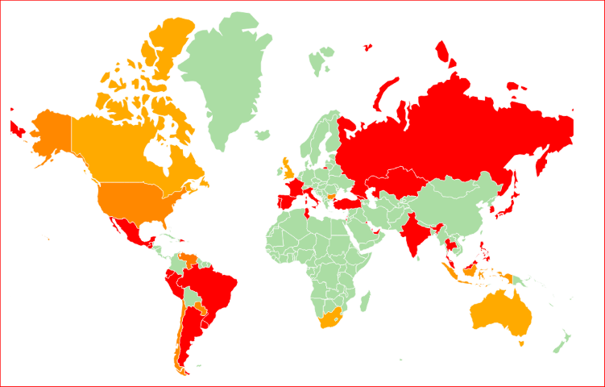

# Twitter Emotional Trend

This simple real-time app uses Twitter stream API, d3.js, socket.io and word-association lexicon to calculate and visualize the current emotional trend of randomly selected geotagged tweets on the world map.



Brighter colors represent more positive tweets.

## Setup
As the very first step you need to fill out your twitter consumer and access token keys/secrets in `config.js` You can register your application [here](https://apps.twitter.com/).

Then just simply run:

```sh
npm install
npm start
```

More info about word-association lexicons can be found [here](http://saifmohammad.com/WebPages/lexicons.html).
